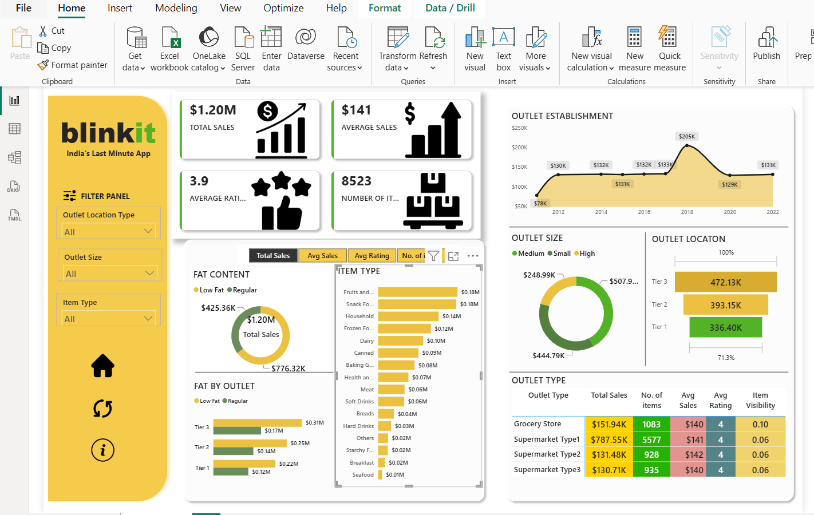

# 🛒 BlinkIT Analysis Dashboard using Power BI

An interactive **Power BI dashboard** analyzing sales performance across Blinkit's outlets — covering total sales, ratings, fat content, item type, outlet establishment trends, outlet size/location, and outlet type, all filterable by outlet location type, outlet size, and item type.

🔗 **Repository:** [Blinkit-analysis-dashboard](https://github.com/niharikakt024/BlinkIT-analysis-dashboard-using-powerBI)

---

## 🖥️ Dashboard Preview

A single-page view combining top-line KPIs, item/fat-content breakdowns, outlet establishment trend, and outlet size/location/type performance.



---

## ✨ Key Features

- **Filter Panel** — Slice by Outlet Location Type, Outlet Size, and Item Type
- **KPI Cards** — Total Sales, Average Sales, Average Rating, and Number of Items
- **Tabbed Breakdown View** — Toggle between Total Sales, Avg Sales, Avg Rating, and No. of Items
- **Fat Content Analysis** — Total sales split by Low Fat vs. Regular
- **Fat by Outlet** — Low Fat vs. Regular sales across outlet tiers (Tier 1, 2, 3)
- **Item Type Breakdown** — Sales ranked across categories (Fruits & Vegetables, Snack Foods, Household, Dairy, etc.)
- **Outlet Establishment Trend** — Sales trend by outlet establishment year (2012–2022)
- **Outlet Size Analysis** — Donut chart of sales by outlet size (Small, Medium, High)
- **Outlet Location** — Sales distribution across Tier 1, 2, and 3 locations
- **Outlet Type Table** — Total Sales, No. of Items, Avg Sales, Avg Rating, and Item Visibility by outlet type

---

## 🛠️ Tech Stack

- **Tool:** Microsoft Power BI Desktop
- **Data Modeling:** Star schema with sales, outlet, and item dimension tables
- **DAX:** Custom measures for average sales, average rating, and item visibility
- **Data Source:** Outlet and item-level sales transactional data

---

## 📁 Repository Structure

```
BlinkIT-analysis-dashboard/
│
├── Blinkit-analysis.pbix          # Power BI dashboard file
├── BlinkIT Grocery Data.xlsx                  # Source data files (if included)
├── Dashboad.png           # Dashboard preview images
└── README.md                # Project documentation
```

---

## 🚀 Getting Started

1. Clone the repository
   ```bash
   git clone https://github.com/niharikakt024/BlinkIT-analysis-dashboard-using-powerBI.git
   ```
2. Open the `.pbix` file in **Power BI Desktop**
3. Refresh the data source (if connected to live data)
4. Use the Filter Panel to explore sales by outlet location type, outlet size, and item type

---

## 📈 Key Insights

- Total sales stand at **$1.20M** across **8,523 items**, with an average rating of **3.9**
- **Regular** fat content items outsell **Low Fat** items (**$776.32K vs. $425.36K**)
- **Fruits and Vegetables** and **Snack Foods** are the top-selling item types, each contributing **$0.18M**
- Outlet establishment saw a sharp spike around **2018 ($205K)** before declining in later years
- **Tier 3** outlets generate the highest sales (**$472.13K**), followed by Tier 2 and Tier 1
- **Supermarket Type1** is the top-performing outlet type by total sales (**$787.55K**) and item count (5,577), despite having the lowest item visibility (0.06)

---

## 👤 Author

**Niharika**
GitHub: [@niharikakt024](https://github.com/niharikakt024)

---

⭐ If you find this project useful, consider giving the repository a star!
